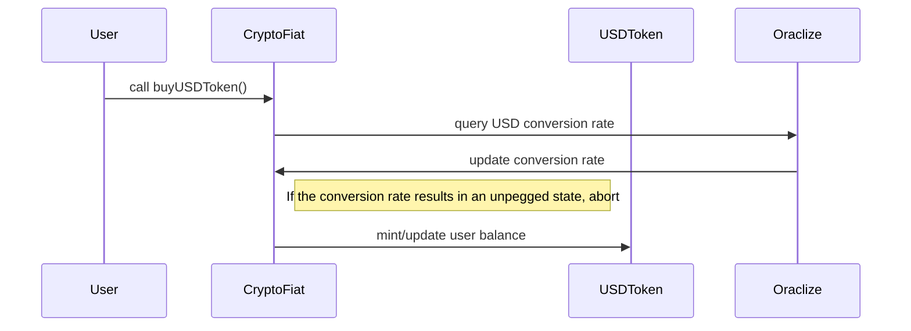
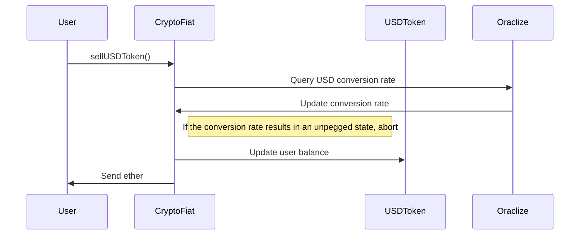

# Proof Crypto Fiat
Official Repository for the Proof Crypto Fiat project


### Contracts

The CryptoFiat system is being built with the intent to provide cryptocurrency users with an option to buy tokens that are pegged to traditional currencies such as the US Dollar or the Euro. Solutions such as the cryptocurrency Tether focus on solving this issue by pegging their currency to dollars and storing physical dollars in a vault. This requires Tether holders to trust a centralized organization, which is at odds with the principles of trustless transactions.

The CryptoFiat aims at providing an decentralized alternative to this problem. The contract will be initially capitalized with vast amounts of Ethereum (~$15M). In addition to this initial seed, the CryptoFiat smart-contract will receive commissions from other smart-contracts in the Proof ecosystem (namely the Proof Prediction Market).

In the event the amount of ether in the smart-contract is insufficient to maintain the pegging of the currencies, the CryptoFiat contract is designed to guarantee crypto-USD and crypto-EUR token holders the amount of ether they initially sent to the smart-contract.

The CUSDToken (crypto-USD token) and CEURToken (crypto-EURO token) are inspired and based on the `StandardToken` and `MintableToken` ERC20 contracts
and augmented with logic for representing the value of the token in the event the crypto-fiat system enters an unpegged state.


### Development and Testing Environment Setup

#### Requirements :
- OSX or Linux (Windows setup is likely possible but not covered in this guide)
- Node (version 8.1.0 recommended for the testing environment)
- testrpc / geth 


#### Testing Environment Setup : 

- Clone the repository and install dependencies

``` 
git clone https://github.com/ProofSuite/ProofCryptoFiat.git
cd ProofCryptoFiat
npm install
```

- Install the latest version of truffle

```
npm install -g truffle
```

- Compile contracts
```
truffle compile
```

- Initialize testrpc (or geth)

```
testrpc
```

- Migrate contracts to chosen network

```
truffle migrate --network development
```

- Make sure you are using the latest version of node

``` 
nvm install 8.1.0
nvm use 8.1.0
```


- Fill in `truffle.js` and `deploy_contracts.js` with appropriate wallet addresses. Unlock the corresponding addresses.

- Verify all tests are passing.

```
truffle test
```

- You can interact with the contracts via the console 

```
truffle console
```

### Contract Function Signature reference:

# Cryptofiat 

### Parent contracts: 
+ Pausable


### State variables: 
+ (USDToken) USDTOken
+ (ProofToken) ProofToken

+ (uint256) conversionRate
+ (mapping) accounts
+ (uint256) dividends

### Methods:
+ getConversionRate()
> Get the latest computed conversion rate
+ updateConversionRate()
> Calls the oraclize API to query the USD/ETH price ticket
+  __callback()
> Oraclize callback function
+ method() : capitalize()
> Call this methods to add additional funds to the contract
+ method() : buyUSDTokens()
> Buy USD Tokens at a pegged price (only callable when the contract is in a pegged state). The amount of dollar tokens received is equal to (msg.value) x (conversionRate).
+ method() : sellUSDTokens()
> Sell USD Tokens at a pegged price (only callable when the contract is in a pegged state). The amount of ether received is equal to (tokenNb) / (conversionRate)
+ method() : buyUnpeggedUSDTokens()
> Buy USD Tokens at an unpegged price (only callable when the contract is in a unpegged state). 
+ method() : sellUnpeggedUSDTokens()
> Sell USD Tokens at an unpegged price (only callable when the contract is in a unpegged state). This function is called when the contract buffer is not sufficient. The amount of ether received is approximately equal to  (tokenNb) / (totalTokenNb) * (USD token price at Buy time). Basically the token holder is refunded the amount of ether he initially bought the tokens for (not in dollar value). 
>This function is used as a mechanism so that every token holder receives at guaranteed amount of ether if the ether price where to go under a certain limit.
+ method() : getUSDTokenValue()
> Get the current USD token value
+ method() : getCurrentState()
> Returns whether the contract is currently in a pegged or unpegged state. If the buffer is sufficient to afford for the current ETH/USD conversion rate, the contract will be in a PEGGED state. If the buffer is not sufficient, the contract will enter an UNPEGGED state so that all users are able to receive the initial amount of ether (in ETH value, not USD) that they initially invested.
+ method() : USDTokenBalance()
> Proxy method to the USD Token contract balance method
+ method() : USDTokenTotalSupply()
> Proxy method to the USD Token contract total supply method


### Sequence Diagrams

+ BuyUSDToken() - pegged state


. 

+ BuyUSDToken() - unpegged state



The flow is similar for sellUnpeggedTokens() and buyUnpeggedTokens()


### Contribution

Thank you for considering helping the Proof project ! 

To make the Proof project truely revolutionary, we need and accept contributions from anyone and are grateful even for the smallest fixes.

If you want to help Proof, please fork and setup the development environment of the appropriate repository. 
In the case you want to submit substantial changes, please get in touch with our development team on our slack channel (slack.proofsuite.com) to 
verify those modifications are in line with the general goal of the project and receive early feedback. Otherwise you are welcome to fix, commit and 
send a pull request for the maintainers to review and merge into the main code base.

Please make sure your contributions adhere to our coding guidelines:

- Code must adhere as much as possible to standard conventions (DRY - Separation of concerns - Modular)
- Pull requests need to be based and opened against the master branch
- Commit messages should properly describe the code modified
- Ensure all tests are passing before submitting a pull request

### License

The Proof CryptoFiat smart contract (i.e. all code inside of the contracts and test directories) is licensed under the MIT License, also included in our repository in the
LICENSE file.